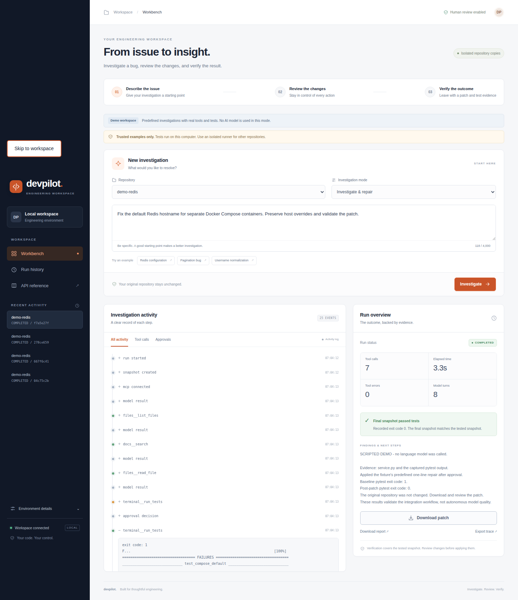
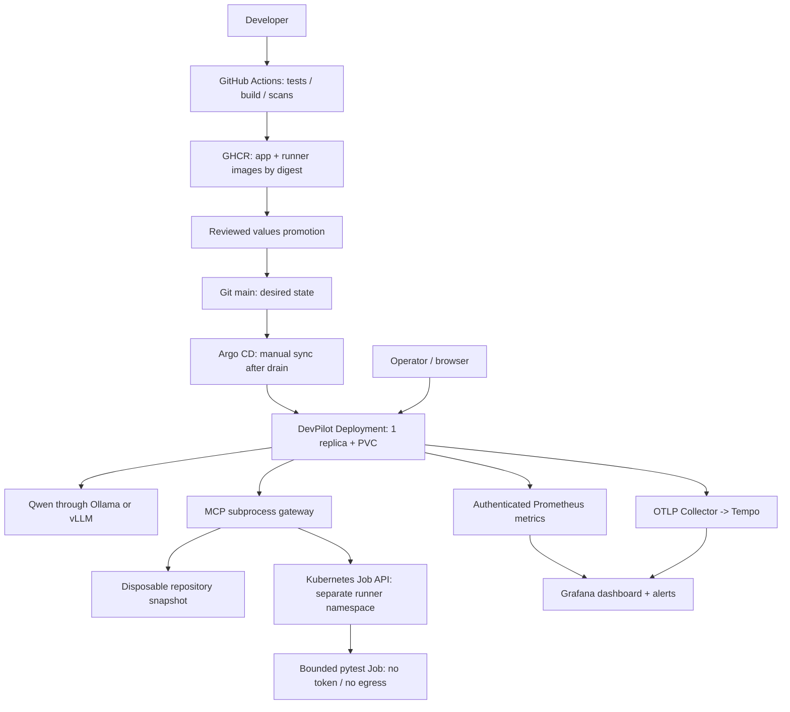
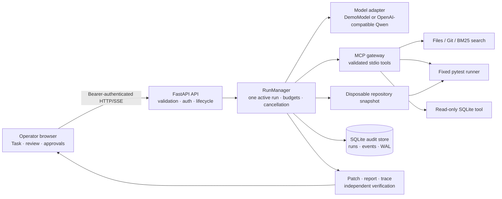
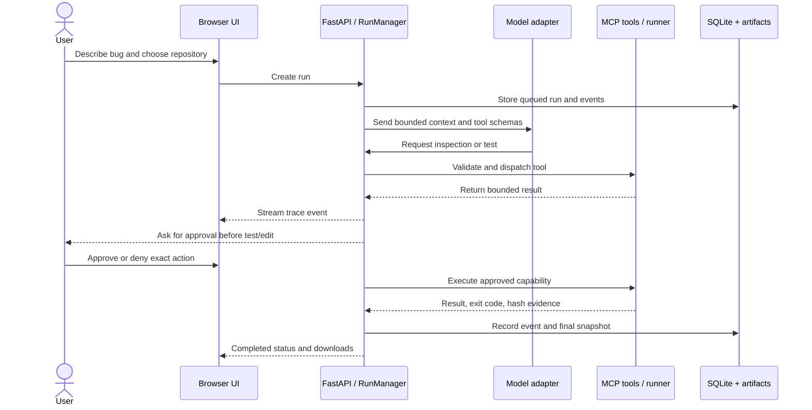

<div align="center">

# Dev-Pilot

### Investigate the failure. Review the patch. Prove the fix. Operate the system.

**An open-weight-LLM debugging workbench with MCP tools, approval-gated changes, isolated test execution, and a DevOps delivery path.**

Python 3.11+ · Qwen · Ollama / vLLM · MCP · FastAPI · Docker · Kubernetes · Helm · GitOps · Prometheus · OpenTelemetry

[Start locally](#start-here-a-working-demo-without-a-gpu) · [Use a real LLM](#connect-a-real-open-weight-llm)

</div>

---

## Why this exists

Debugging crosses boundaries: source code, configuration, tests, repository history, runtime state, and review. A plausible explanation is not proof that a repair works.

**Dev-Pilot connects investigation to evidence.** It investigates a disposable copy of a Python repository, proposes exact edits, asks a human before changing or executing code, runs tests, and exports a patch with a trace and an independently computed verification result. The original repository is not its working directory.

The DevOps layer operates that **actual application**: it builds and scans its images, packages a guarded Helm deployment, executes tests in separate Kubernetes Jobs, publishes metrics/traces, drains active work before updates, and backs up its audit state.

> **Scope:** a single-operator, single-active-run engineering workbench. This is not a multi-tenant SaaS, an unrestricted shell agent, or a claim that autonomous code is safe for production infrastructure.



*Completed-state screenshot from a real local Chrome workflow. The connected session uses the bundled scripted demo; it is not a live-model or Kubernetes demonstration.*

### Verified local UI workflow

The browser workflow was exercised against the real FastAPI application with Chrome. It connected to the workspace, selected the Redis fixture, started an investigation, approved the baseline test, reviewed and approved the exact file replacement, approved the post-edit test, reached `COMPLETED` with independent verification, downloaded the generated patch, checked the activity filters, and reported no page errors. The same page was checked at 1500, 1024, 768, 390, and 360 pixel widths without horizontal overflow.

This evidence covers the scripted demo integration path. It demonstrates the UI, API, approval flow, tools, test runner, patch download, and responsive layout; it does not claim that a live model repaired a new repository. The recorded result is [`outputs/local-ui-redesign/browser-results.json`](outputs/local-ui-redesign/browser-results.json), and the repeatable browser check is [`outputs/local-ui-redesign/browser_check.py`](outputs/local-ui-redesign/browser_check.py).

## A concrete workflow

> “Reproduce the Redis hostname configuration bug, propose the smallest fix, and rerun the tests. Do not modify the tests.”

```text
Read and search repository  ->  Approve baseline pytest run
         |
         v
Find evidence  ->  Review exact patch + file hash  ->  Approve edit
         |
         v
Approve post-edit pytest run  ->  Check exit code + snapshot identity
         |
         v
Download changes.patch + report.md + trace.json
```

The included Redis fixture tests a configuration default; it does **not** claim to connect to a real Redis server. The pagination and username-normalization fixtures provide two more repeatable examples.

## What is implemented

| Layer | Shipped behavior |
|---|---|
| AI integration | OpenAI-compatible adapter for operator-configured Qwen through Ollama or vLLM; native structured tool calls, bounded retries/context/steps/time |
| MCP | Five subprocess servers for files, Git, BM25 docs/code search, fixed pytest, and read-only SQLite; optional Docker observation |
| Review and verification | Exact-action signed approvals, hash checks, protected tests, original-repository isolation, verification derived from test results rather than the model's claim |
| Application | FastAPI, browser UI, streamed trace, approve/deny, cancellation, durable SQLite history, downloadable patch/report/trace |
| Test execution | Disabled, trusted-demo host, restricted Docker, or **isolated Kubernetes Job** runner; no generic shell tool |
| Containers | Separate app and test-runner images, non-root users, bounded resources, no host Docker socket in Compose or the Helm chart |
| Delivery | SHA-pinned Actions, Python matrix, container/fixture checks, Helm lint, scanning, GHCR image publishing with BuildKit SBOM/provenance, reviewed digest promotion |
| Kubernetes | One API replica, Recreate updates, persistent state, health/readiness/startup probes, resource limits, separate runner namespace, scoped RBAC and deny-network policy |
| Observability | Token-protected Prometheus endpoint, dashboard, alert rules/tests, JSON operational logs, optional OTLP traces through Collector and Tempo |
| Operations | Drain/resume, offline hash-checked backups and restore-to-new-directory, Compose/Kubernetes backup helpers, runbooks and explicit rollout/rollback procedures |
| Infrastructure as code | Helm + Argo CD; optional Terraform installer for an **existing cluster**, as an alternative release owner |

**Not shipped:** automatic GitHub cloning/push/PR creation, full/latest MCP-spec certification, PostgreSQL/Redis migration, API autoscaling, zero-downtime failover, unrestricted terminal access, automatic incident remediation, or measured live-LLM success rates.

## Start here: a working demo without a GPU

**Prerequisites:** Linux/WSL2, Python 3.11–3.13, Git. The container path additionally needs Docker Engine and the Compose plugin. Internet access is needed for dependencies/images. No GPU, model download, cloud account or paid API is needed for the demo.

For the shortest local path in this archive:

```bash
./setup.sh
./run.sh
```

From the extracted `devpilot/` directory:

```bash
python3 scripts/bootstrap.py

docker compose up -d --build

docker compose ps
cat .secrets/api-token
```

Open **http://127.0.0.1:8088**, paste the token, select **demo-redis**, and click **Investigate**. Review and approve baseline tests, the exact patch, and post-edit tests. Download the resulting artifacts.

**This default is a scripted integration demo, not an LLM.** `DP_PROVIDER=demo` follows a predefined action sequence but performs real MCP calls, approved edits, Git diff generation, and pytest execution. It only accepts the unchanged bundled fixtures. Do not describe its successful repairs as Qwen accuracy.

### Prefer running Python directly?

```bash
python3 -m venv .venv
source .venv/bin/activate
python -m pip install -r requirements/dev.txt
python -m pip install --no-deps -e .
python scripts/bootstrap.py
python -m devpilot serve --seed
```

Open the same **8088** address. The bootstrap explicitly enables host execution **only for the trusted bundled demo**. Run one startup path at a time on port **8088**. Use `python -m devpilot doctor` and the application logs for troubleshooting.

### Where is `.env`?

```text
devpilot/
  .env.example       committed configuration reference
  .env               generated locally; NOT committed
  .secrets/          generated API, metrics and Grafana credentials; NOT committed
  compose.yaml
  README.md
```

`bootstrap.py` creates private local files and preserves existing ones. Show hidden files with `ls -la` or **Ctrl+H** in Ubuntu Files. Open configuration with `code .env` or `nano .env`. **Never paste tokens into issues, screenshots, repository commits or prompts.** Compose uses its explicit `environment:` settings and mounted `.secrets/`; editing `DP_PROVIDER` in `.env` alone does **not** turn the demo Compose service into a live-model deployment.

## Connect a real open-weight LLM

The first live path uses the **host Python application plus Docker for isolated pytest**. Stop the demo Compose app before reusing its port:

```bash
docker compose stop devpilot
ollama pull qwen3:4b
# Start `ollama serve` only if its service is not already running.
docker build -f Dockerfile.runner -t devpilot-runner:local .
```

Change the following entries in `.env`, retaining your generated token-file paths:

```dotenv
DP_PROVIDER=openai
DP_BASE_URL=http://127.0.0.1:11434/v1
DP_MODEL=qwen3:4b
DP_LLM_API_KEY=local
DP_RUNNER=docker
DP_RUNNER_IMAGE=devpilot-runner:local
DP_TRUST_LOCAL_CODE=false
DP_MAX_CONTEXT_CHARS=16000
DP_PORT=8088
```

Then, in the activated Python environment:

```bash
python -m devpilot doctor
python scripts/check_model.py
python -m devpilot serve --seed
```

`openai` is the adapter name: **the model is local Qwen, not GPT or a paid OpenAI dependency**. The check script tests one harmless structured tool call; it does not execute a returned tool or establish debugging quality.

The separate vLLM path uses **`Qwen/Qwen3-4B-Instruct-2507`**, not the same checkpoint as Ollama's `qwen3:4b`. It serves an OpenAI-compatible endpoint on port **18000** and requires operator-selected parser settings and suitable GPU capacity. No model weights are in this archive.

## Add the observability stack

For the container demo:

```bash
docker compose -f compose.yaml -f compose.monitoring.yaml up -d --build
cat .secrets/grafana-password
```

| Service | Local address | Access |
|---|---|---|
| DevPilot | http://127.0.0.1:8088 | `.secrets/api-token` |
| Grafana | http://127.0.0.1:13000 | `admin` + generated Grafana password |
| Prometheus | http://127.0.0.1:19090 | Localhost only |
| Alertmanager | http://127.0.0.1:19093 | Localhost only; external notification receiver not configured |

The provisioned dashboard shows request rates, header latency, tool failures, approval waits, model request timing, actual token usage when returned, and run outcomes **separated by provider**. Collector/Tempo expose no public host ports. Model weights and GPU metrics require separate exporters.

## DevOps architecture



MCP servers stay **inside the API pod as stdio subprocesses**. Pretending they are independent network microservices would require a transport/auth redesign, not merely more Deployments.

### Deploy to a local Kubernetes lab

Install Docker, `kind`, `kubectl` and Helm 3, then run:

```bash
bash scripts/kind-up.sh
kubectl --context kind-devpilot -n devpilot port-forward svc/devpilot 8088:8080
```

The helper creates only a dedicated `kind-devpilot` lab, installs a versioned Calico manifest, builds/loads both images, creates namespace policy and credentials, installs the chart, and checks runner network denial against a reachable control target. It refuses to overwrite an existing cluster. **These cluster operations were not runnable in the packaging environment.** Run the included `kind-integration` workflow or local lab to produce your own cluster evidence.

For an existing cluster, configure private ingress and TLS, live-model values, registry credentials, reviewed GitOps promotion, and one deployment owner before rollout.

## Engineering decisions that matter

**One replica is a correctness requirement.** The API uses SQLite and in-process approvals. The chart rejects multiple replicas; Recreate avoids two owners of one state volume. A process lease prevents a second serving process. A shared queue, approval store, run ownership and database migration are prerequisites for HA—not TODOs hidden behind an HPA.

**Approval is enforced by code, not a prompt.** A signed, single-use capability binds the tool, arguments, workspace hash and expiry. The tool boundary verifies it. The model cannot change the runner image, namespaces, limits or policy.

**Tests execute outside the control plane in Kubernetes.** A small snapshot is transferred in an immutable ConfigMap to a separate Job. The test container has no app volume, service-account token or model credentials. Restricted admission and an enforcing CNI are prerequisites. Containers still share the host kernel; this is not a hostile-code VM sandbox.

**Deployment must respect active work.** Drain rejects new runs and waits for existing work; updates are manually synchronized after that point. A process restart interrupts—not resumes—unfinished approvals. Rollback is a reviewed Git revert plus sync, with an explicit maintenance window.

**Honest evidence beats impressive-looking percentages.** Demo replay, model correctness, HTTP health, test verification, container validation and cluster validation are separate results. The app's `verified` flag is not set by an assistant saying “fixed.”

## Validation and reproducibility

Validation keeps packaged test counts, coverage, replay outputs and skipped checks explicit. There are no fabricated GPU timings, live-model solve rates, deployment screenshots or green CI badges.

```bash
python -m pytest -q
python scripts/validate-configs.py
python -m devpilot evaluate --out outputs/local-evaluation --label my-scripted-replay

# Real-model measurement: configure Qwen AND an isolated runner first.
python -m devpilot evaluate --live --out outputs/live-qwen --label my-qwen-run
```

`requirements/*.txt` contain observed exact constraints, **not a fabricated hash lock**. Regenerate/review dependency locks on a connected machine. Third-party image versions are lab candidates, not a claim that the registry images are currently vulnerability-free. CI's security gates can fail and must be investigated, not disabled to make a badge green.

## Repository map

```text
devpilot/                 agent, API, MCP, tool policy, model adapter, telemetry, backups
runner/                   fixed pytest Kubernetes entrypoint
tests/                    unit, subprocess, HTTP, security and optional integration checks
helm/devpilot/            guarded chart, values schema, probes, PVC, RBAC, ServiceMonitor
infra/                    kind config, runner namespace policy, optional vLLM service
deploy/environments/      staging and digest-required production values
argocd/                   scoped project and manually synchronized application
terraform/                optional existing-cluster Helm delivery (alternative to Argo)
monitoring/               Prometheus rules/tests, Grafana, Collector, Tempo, Alertmanager
.github/workflows/        CI, publish, security, opt-in kind integration
scripts/                  bootstrap, diagnostics, drain, promotion, backups, packaging
docs/                     model/environment/deployment/security/operations runbooks
outputs/                  actual validation artifacts for this version
outputs-previous-0.2.0/    historical evidence, NOT current version results
```

## Architecture at a glance



The model never receives direct filesystem access. It requests a structured tool call; the API checks policy, risk, workspace boundaries, approval capability, budgets, and hashes before a tool can act. The browser is a review surface, not the security boundary.

## One investigation from request to evidence



## What happens in the shipped demo

The three bundled fixtures make the workflow easy to demonstrate:

1. **Redis hostname:** the copied fixture uses `localhost` where Compose services need the service name `redis`.
2. **Pagination:** the copied fixture drops the last item because of an off-by-one slice.
3. **Username normalization:** the copied fixture fails to trim whitespace and use Unicode-aware case folding.

The Redis run is the documented demonstration: baseline pytest is approved, the exact replacement is shown with its expected file hash, the edit is approved, post-edit pytest is approved, and the application derives verification from the actual result. The original repository stays unchanged.

## Visual evidence

Disconnected state, ready state, exact approval review, completed verification, and mobile layout are available as separate captures:

| State | Screenshot |
|---|---|
| Before authentication | [desktop-disconnected.png](outputs/local-ui-redesign/desktop-disconnected.png) |
| New investigation ready | [desktop-ready.png](outputs/local-ui-redesign/desktop-ready.png) |
| Exact edit awaiting approval | [desktop-approval.png](outputs/local-ui-redesign/desktop-approval.png) |
| Verified completed run | [desktop-completed.png](outputs/local-ui-redesign/desktop-completed.png) |
| Completed mobile layout | [mobile-completed.png](outputs/local-ui-redesign/mobile-completed.png) |

The primary README image is the completed state captured from the local application:


## Engineering highlights

| Area | What this project demonstrates |
|---|---|
| AI integration | A common interface for deterministic scripted replay and an OpenAI-compatible live model adapter. |
| Security | Exact-action approvals signed with HMAC, single-use capabilities, hash checks, protected test files, path boundaries, redaction, and explicit remote-model consent. |
| Tooling | MCP-style stdio subprocesses with schemas, bounded output, risk labels, and separate handlers for files, Git, search, tests, and SQLite. |
| Reliability | One-owner run state, cancellation, budgets, timeouts, restart interruption, WAL-backed audit history, and atomic artifacts. |
| Verification | Test exit codes, final snapshot identity, patch/report/trace export, and a verified flag calculated by the application. |
| Frontend | Vanilla HTML/CSS/JavaScript, authenticated fetch, SSE plus polling, approval controls, activity filters, session token storage, and responsive layout. |
| Delivery | Docker images, Helm safeguards, one-replica SQLite ownership, isolated Kubernetes test Jobs, scoped RBAC, digest-aware promotion, and drain-before-update operations. |
| Observability | Bounded Prometheus metrics, JSON logs, optional OTLP traces, dashboards, alerts, and audit events kept separate from telemetry. |

## Validation snapshot

The recorded browser evidence is intentionally specific and reproducible:

- Chrome UI workflow: **passed**.
- Approval sequence: `terminal__run_tests → files__replace_text → terminal__run_tests`.
- Independent verification indicator: **passed**.
- Patch download: **checked**.
- Activity filters: **checked**.
- Page errors: **none**.
- Responsive widths: 1500, 1024, 768, 390, and 360 pixels with no horizontal overflow.

See [`outputs/local-ui-redesign/browser-results.json`](outputs/local-ui-redesign/browser-results.json) for the machine-readable record. This proves the scripted integration path. The live-model experiment is documented separately and did not produce a verified repair, so this README does not present the demo as evidence of autonomous AI correctness.

## A strong interview explanation

> Dev-Pilot is a single-operator debugging workbench. It investigates a disposable copy of a Python repository, gives a model bounded MCP-style tools, requires human approval for edits and test execution, records every step in SQLite, and derives verification from test results and workspace identity. Its scripted demo is deterministic for integration testing; its live model path is OpenAI-compatible and explicitly measured separately.

A useful five-minute walkthrough is: show the problem, explain the copy boundary, run baseline tests, review the exact diff, approve the edit, approve post-edit tests, download the patch, then show the evidence record. Finish by naming the real limitations: one active run, one API replica, no resumable approvals, and no claimed live-model success rate.

## Project map for a reviewer

```text
devpilot/api.py             HTTP routes, authentication, SSE, health, downloads
devpilot/runtime.py         Run state machine, approvals, budgets, artifacts
devpilot/models.py          DemoModel and OpenAI-compatible model adapter
devpilot/mcp/client.py      Stdio process lifecycle and structured dispatch
devpilot/mcp/server.py      Pinned MCP subset and capability enforcement
devpilot/safety.py          Workspace copy, hashes, replacements, capabilities
devpilot/tools/             Files, Git, search, pytest, SQLite, Docker, Kubernetes
devpilot/store.py           SQLite runs/events store and restart interruption
devpilot/static/            Browser UI, responsive CSS, authenticated JavaScript
tests/                      Unit, API, protocol, safety, runtime and integration checks
helm/ deploy/ monitoring/   Delivery, cluster policy, telemetry and operations
```

---

**MIT-licensed application code.** Model weights, dependencies and infrastructure images have their own licenses. No employer code, credentials, model weights or Terraform state are included. Keep this private/local until the deployment and security acceptance checks are complete.
