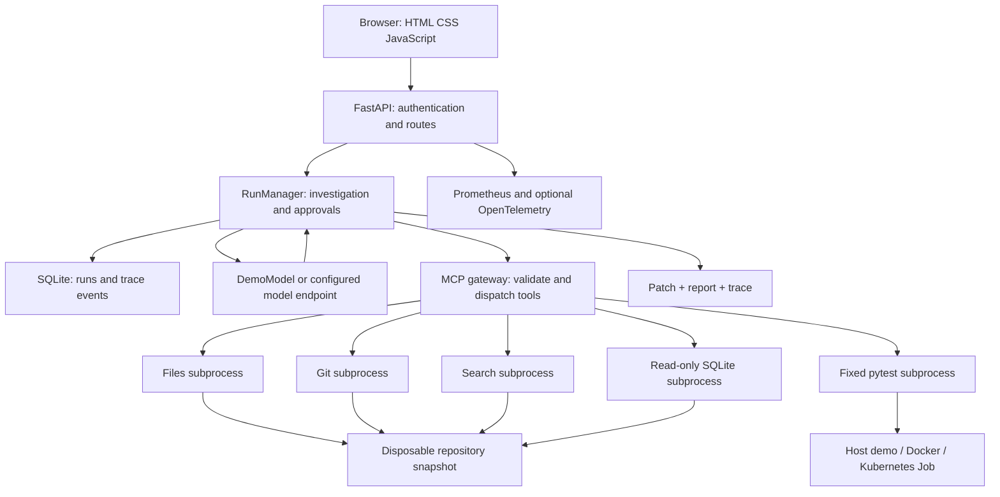

# DevPilot: end-to-end codebase walkthrough

This guide describes the source in this checkout, version 0.3.0, reviewed on 2026-09-21. Paths below are relative to the project root. It complements the existing [full guide](DEVPILOT_FULL_GUIDE.md) with a module map and precise runtime behavior. The local validation results are recorded separately in [LOCAL_RUN_STATUS.md](LOCAL_RUN_STATUS.md).

## 1. What it is and why it exists

DevPilot is a web-based debugging workbench for small Python repositories. A user supplies a bug report; the application lets a model inspect relevant files, propose a small repair, request approval, and run tests. It records the actions and exports a patch, report, and trace.

Its central problem is the gap between a plausible AI answer and a demonstrated repair. A chat answer can suggest code without reading the relevant implementation, reproducing the bug, or testing the result. DevPilot connects those steps and gives the operator evidence to review.

For example, a service in its own container cannot generally reach a separate Redis container through `localhost`. The bundled Redis exercise starts with that incorrect default. DevPilot reads the code, runs the failing checks, changes the default to `redis`, runs the checks again, and exports the one-line patch. This fixture checks configuration logic; it does not connect to Redis.

Useful applications include learning agent/tool architecture, investigating small Python bugs, reviewing model-generated repairs, reproducing debugging workflows, and practicing the deployment and operation of an AI application. It is designed for one operator and one active investigation, with one application process.

## 2. What is implemented—and its boundaries

| Capability | Actual behavior |
|---|---|
| Investigation | Reads and searches a disposable repository snapshot |
| Repair | Replaces one exact text occurrence in an existing file after approval |
| Diagnose mode | Removes write tools; approved test execution remains possible |
| Verification | Records a fixed pytest command, exit status, and snapshot hashes |
| Review | Shows exact edit diff, action hash, and workspace hash |
| Evidence | Persists run history/events and exports patch, Markdown report, JSON trace |
| Model integration | Uses a configured OpenAI-compatible chat-completions endpoint |
| Demo | Executes a hard-coded sequence for three unchanged bundled fixtures |
| Deployment | Local Python, Compose, or a single-replica Kubernetes deployment |
| Operations | Health, readiness, metrics, traces, drain/resume, offline backup |

It does not clone GitHub repositories, push commits, open pull requests, install project dependencies on demand, provide a generic shell, or autonomously deploy fixes. It does not implement multi-user permissions, a distributed job queue, high availability, or broad live-model quality measurements. Search uses BM25 rather than embeddings or a vector database.

The model adapter name `openai` identifies the API format. The documented model paths use Qwen served through Ollama or vLLM; a paid API account is not required for the bundled demo. No model weights are included.

## 3. Architecture and why each layer is used



| Technology | Purpose and reason for use here |
|---|---|
| Python 3.11+ | Implements the agent, tools, HTTP service, and pytest workflow in one language |
| FastAPI + Uvicorn | Typed HTTP requests, async coordination, static UI, and streamed events |
| Pydantic Settings | Reads `DP_` settings and rejects incompatible configuration |
| Plain HTML/CSS/JS | A small browser UI without a Node build pipeline or frontend framework |
| HTTPX | Calls the model, Kubernetes API, and application smoke endpoints |
| MCP over stdio | Gives tools a structured discovery/call interface in separate subprocesses |
| JSON Schema | Validates tool arguments at the gateway and server boundaries |
| SQLite | Durable local audit records without operating a separate database server |
| Git | Creates a baseline in the copied workspace and produces a reviewable diff |
| BM25 | Finds relevant code/doc passages locally without downloading an embedding model |
| pytest | Reproduces and checks the supported Python tasks |
| Docker / Kubernetes Jobs | Run tests with bounded resources and separation from the application |
| Helm / Argo CD / Terraform | Package and manage optional cluster deployment |
| Prometheus / Grafana / OTLP | Observe application behavior and operational failures |

MCP servers are local subprocesses, not independently deployed network microservices. The language model selects a tool and arguments; Python application code controls what is available and whether it may execute.

## 4. Full lifecycle: from startup to downloaded patch

1. `python -m devpilot` enters `devpilot/__main__.py`, which calls `cli.main()`.
2. `serve --seed` loads `Settings`, seeds missing bundled repositories, configures logging, builds the FastAPI app, and starts one Uvicorn worker.
3. `create_app()` obtains the API token and constructs `RunManager`. Application startup takes an exclusive filesystem lease and marks unfinished historical runs as `interrupted`.
4. The browser loads `/` and `/static/*`. Connect submits the bearer token to `/api/config`, loads repositories, and reads recent history.
5. Investigate submits `POST /api/runs` with `repo`, `task`, and `mode`. Inputs are validated. Busy, draining, and retention conditions reject new work.
6. In demo mode, the repository name and fingerprint must match an unchanged bundled fixture. A custom task string does not make the scripted demo solve a new problem.
7. `RunManager.create()` inserts a queued record and launches an asyncio task. The original source is fingerprinted; approved regular files are copied to `DATA_DIR/runs/ID/workspace`.
8. `gitops.initialize()` creates a fresh Git repository and baseline in the copy. Original Git history, hooks, and configuration are not imported.
9. The manager selects `DemoModel` or `OpenAIModel`. It sends the system prompt, task, and allowed tool definitions to that model.
10. `Gateway` starts five MCP subprocesses, negotiates the pinned protocol, and discovers tools. Optional Docker observation adds a sixth server.
11. A returned tool call is parsed and schema-validated. Reads execute directly. Writes and tests pause in `awaiting_approval`.
12. The approval records exact arguments, their hash, the workspace fingerprint, and an edit diff when applicable. The browser posts the operator's decision.
13. On approval, the application signs a short-lived, single-use capability. The MCP server checks its signature, tool, arguments, expiry, nonce, and current snapshot before acting.
14. Tool results are persisted and fed back to the model. The loop continues until a final response, cancellation, error, or budget limit.
15. Finalization compares the current workspace with the tested snapshot, records whether the source remained unchanged, generates the Git diff, and writes artifacts.
16. The browser shows status and verification and enables artifact downloads. Applying a patch to the real repository is a separate operator action.

### Run states

`queued → running ↔ awaiting_approval → completed / failed / cancelled / limit_reached`

A restart changes unfinished runs to `interrupted`; it does not resume their in-memory approval futures. `completed` means the model loop ended with a final response. It does not automatically mean the tests passed.

### What “verified” actually means

In `runtime.py`, verification requires a recorded test result with exit code zero, no timeout, no output-limit termination, and a final workspace matching the snapshot tested. The runner must also report that the snapshot was unchanged during execution.

`source_unchanged` is recorded separately; it is not part of the `verified` Boolean expression. A denied demo operation can end with status `completed` but without successful verification. Always read both the status and verification fields.

Tests establish only the behavior they cover. The evaluation harness adds further fixture checks after the agent finishes; those checks are not part of the interactive model's evidence.

## 5. Application module map

| File | Responsibility and connection to the rest of the application |
|---|---|
| `devpilot/__init__.py` | Defines package version |
| `devpilot/__main__.py` | Enables `python -m devpilot` |
| `devpilot/cli.py` | Implements init, token, doctor, serve, replay, evaluate |
| `devpilot/config.py` | Settings, allowed providers/runners, credential-file loading, path and URL validation |
| `devpilot/api.py` | HTTP routes, bearer authentication, origin/host checks, UI files, SSE, health and admin operations |
| `devpilot/runtime.py` | Central state machine: snapshots, model loop, approval futures, cancellation, evidence and exports |
| `devpilot/models.py` | Model response types, HTTP adapter with bounded retries, and scripted DemoModel |
| `devpilot/prompts.py` | Evidence-first instructions passed to the model; enforcement remains in code |
| `devpilot/demo.py` | Fixture definitions, one-line predefined repairs, seeding and fingerprint validation |
| `devpilot/evaluation.py` | Three-task replay/live harness, fixture-scoped automatic approvals, separate grading and summaries |
| `devpilot/safety.py` | Workspace boundaries, excluded paths, bounded copying, hashing, exact replacements, redaction and signed capabilities |
| `devpilot/process.py` | Fixed argument-vector subprocess execution, sanitized environment, output/time limits and descendant cleanup |
| `devpilot/gitops.py` | Initializes snapshot Git baseline and reads diff/status/history using controlled commands |
| `devpilot/retrieval.py` | Splits text into overlapping chunks, annotates Python symbols, ranks results using BM25 |
| `devpilot/store.py` | SQLite runs/events tables, CRUD, chronological event retrieval and restart interruption |
| `devpilot/lease.py` | Linux `flock` lease to prevent simultaneous serving/maintenance against the same state |
| `devpilot/telemetry.py` | Per-manager Prometheus metrics, structured operational logging, optional OTLP tracing |
| `devpilot/backup.py` | Offline archive creation, manifest hashes, bounded validation and restore to a new directory |
| `devpilot/mcp/__init__.py` | Pins the supported MCP protocol version |
| `devpilot/mcp/client.py` | Stdio subprocess lifecycle, JSON-RPC request IDs, tool discovery/validation and signed dispatch |
| `devpilot/mcp/server.py` | Initialization, tools/resources/prompts/ping, schema checks and capability enforcement |
| `devpilot/tools/__init__.py` | Marks the tools package |
| `devpilot/tools/registry.py` | Authoritative catalog of tool schemas, handlers and risk classifications |
| `devpilot/tools/runner.py` | Selects the runner and executes the fixed pytest command with snapshot checks |
| `devpilot/tools/kubernetes.py` | Archives a snapshot, creates Job/ConfigMap, observes completion/logs and cleans up |
| `devpilot/tools/database.py` | Bounded read-only SQLite connection with an authorizer and execution deadline |
| `devpilot/tools/docker.py` | Optional label-scoped container listing, state inspection and recent logs |
| `devpilot/static/index.html` | Workbench layout, connection, task entry, trace, approvals and result panels |
| `devpilot/static/app.js` | Authenticated fetch, session token storage, run creation, polling, SSE, decisions and downloads |
| `devpilot/static/style.css` | Visual layout, status styles and responsive presentation |
| `runner/job_entrypoint.py` | Validates/extracts the transferred snapshot and invokes pytest inside a Kubernetes test container |

### Model behavior

`OpenAIModel.complete()` posts messages and native function-tool definitions to `/chat/completions`. It allows up to three attempts for selected temporary failures, bounds response size and tool-call count, and rejects malformed or truncated responses. Each response is obtained without model token streaming; the browser streams application trace events instead. Provider-specific reasoning fields are not displayed, and `<think>` blocks are removed from displayed content.

There is no automatic context summarization. Exceeding the configured context budget stops the run. Actual token usage is recorded only when the provider supplies it.

### Search behavior

Search splits files into windows of up to 60 lines, advancing 40 lines each time. It tokenizes identifiers, paths, symbols and text, then ranks matches using BM25. Rebuilding from the current snapshot lets searches reflect approved edits. Returned paths and line ranges help trace a suggestion back to evidence.

## 6. Tool catalog and permission model

| Model-visible name | What it does | Approval |
|---|---|---|
| `files__list_files` | Lists eligible snapshot files | No |
| `files__read_file` | Returns text, line numbers and current file hash | No |
| `files__replace_text` | Replaces a unique exact match with an expected file hash | Yes |
| `git__status` | Reads snapshot Git status | No |
| `git__diff` | Reads changes relative to snapshot baseline | No |
| `git__history` | Reads the newly created snapshot history | No |
| `docs__search` | Searches code and docs with BM25 | No |
| `terminal__run_tests` | Runs fixed pytest against `tests/` | Yes |
| `database__schema` | Reads a small workspace SQLite database's schema | No |
| `database__query` | Executes restricted read queries | No |
| `docker__list_containers` | Lists containers with the configured operator label | No; tool is opt-in |
| `docker__inspect` | Reads selected state without container environment variables | No; tool is opt-in |
| `docker__logs` | Reads the last 100 lines of scoped container logs | No; tool is opt-in |

There are 10 default tools, or 13 with Docker observation enabled. Docker observation and the Docker pytest runner are separate settings.

MCP implements a pinned 2025-06-18 stdio subset with initialization, tools, resources, prompts, and ping. It is not a general remote MCP hub. Resource support includes `workspace://overview` and `repo:///{path}`; the debugging prompt is also exposed through MCP.

Edits reject test paths, `test_*` files, and `conftest.py`. File SHA256 prevents an edit based on stale content. Approval capability checks also reject changes to any fingerprinted workspace content after the operator reviewed the action.

The repository boundary excludes known secret filenames, most `.env` files, Git internals, symlinks, caches and oversized files. Limits are 120,000 bytes per eligible file, 1,500 eligible files, and 12,000,000 total copied bytes. Oversized files can be omitted from the snapshot, so this is not a complete mirror of every possible project. Redaction is pattern-based and cannot identify every secret.

## 7. Test runners and project compatibility

The fixed command is:

```bash
python -m pytest -q -p no:cacheprovider -o addopts= -o pythonpath=. tests
```

| Runner | Behavior | Appropriate scope |
|---|---|---|
| `disabled` | Refuses test execution | Read-only investigation or unconfigured install |
| `host-trusted` | Executes in a local subprocess; requires explicit trust setting | Bundled trusted fixtures |
| `docker` | Uses an existing runner image, read-only workspace, no network, bounded CPU/memory/PIDs | Prepared Python project dependencies |
| `kubernetes` | Transfers snapshot through immutable ConfigMap and starts a separate Job | Cluster deployment with enforced runner policy |

A runner needs the project's dependencies already installed in its environment/image. DevPilot cannot repair arbitrary projects just because they have been copied into `workspace/`. It expects a Python pytest suite in `tests/`, bounded files, and dependencies compatible with the selected runner.

The Kubernetes archive has an additional 700,000-byte compressed limit. Jobs use no service-account token, no app data volume, a non-root identity, dropped capabilities, and resource/deadline limits. Runner network denial depends on an enforcing CNI and the namespace policies. This is container isolation, not a virtual-machine boundary for hostile code.

## 8. HTTP API and browser flow

All `/api/*` routes require the API bearer token. Metrics has a separate token. Static UI and process health endpoints are public on the configured listener.

| Method and path | Purpose |
|---|---|
| `GET /` | Browser workbench |
| `GET /livez`, `/healthz` | Application process health; does not prove model availability |
| `GET /readyz` | Checks drain state, database access and writable state directory |
| `GET /metrics` | Prometheus metrics with a distinct credential; 404 if unconfigured |
| `GET /api/config` | Non-secret active configuration and active-run ID |
| `GET /api/model/health` | Demo availability or model listing; not a tool-use quality test |
| `GET /api/repos` | Eligible repository directory names |
| `POST /api/runs` | Starts an investigation, returning HTTP 202 and run ID |
| `GET /api/runs` | Recent history |
| `GET /api/runs/{id}` | Status, pending decision, metrics and verification |
| `POST /api/runs/{id}/cancel` | Cancels the current run |
| `POST /api/runs/{id}/approvals/{approval_id}` | Accepts strict Boolean `approved` decision |
| `GET /api/runs/{id}/events?after=0` | SSE event stream with sequence cursor |
| `GET /api/runs/{id}/artifacts/{kind}` | Downloads `patch`, `report` or `trace` after termination |
| `POST /api/admin/drain` | Rejects new runs while current work finishes |
| `POST /api/admin/resume` | Allows new runs again |

The browser stores the token in `sessionStorage`. It uses `fetch()` to stream SSE so it can supply an Authorization header, and polls status every 800 ms. Model/file content is displayed with `textContent`. The API adds host/origin checks and browser security headers.

## 9. Data and artifacts

```text
workspace/
  demo-redis/                  original seeded input
  demo-pagination/
  demo-normalize/
.devpilot-local/              default for run.sh
  service.lock                exclusive process lease
  server.pid                  run.sh / stop.sh process tracking
  access-token                fallback credential if no configured token
  audit.sqlite3               run metadata and events; SQLite WAL mode
  runs/<run-id>/
    workspace/                copied code plus newly initialized Git baseline
    changes.patch             application-code changes
    report.md                 explanation, checks, metrics and tool evidence
    trace.json                exported run and event records
.secrets/                     bootstrap-generated credential files
.env                          local configuration
```

Direct CLI startup uses the data directory from settings, usually `.devpilot` in the generated `.env`; `run.sh` explicitly defaults to `.devpilot-local`. Compose stores `/data/state` and `/data/workspace` in a named volume.

SQLite has `runs` and `events` tables. Run metadata is mostly JSON inside each run row; events have globally increasing sequence IDs and an index by run/sequence. Pending approval futures live in process memory. The default maximum is 100 stored runs; reaching it blocks new runs rather than deleting old evidence automatically.

Backup takes the same process lease as serving, uses SQLite's backup API, includes state/workspace files and a checksum manifest, and excludes credentials. Restore validates archive paths/hashes and writes a new target directory. See [BACKUP.md](BACKUP.md) for the maintenance procedure.

## 10. Configuration and local startup

The environment already contains `.venv`, `.env`, and credential files. Existing configuration should be preserved. `setup.sh` bootstraps missing files, creates a virtual environment if needed, installs `requirements/dev.txt`, and installs this package editable.

From a terminal:

```bash
cd '/home/punam/Music/IMPFolder/Project/devpilot-devops-complete (2)/devpilot'
# Needed on a fresh checkout; existing working environments can skip this:
./setup.sh
./run.sh
```

Open **http://127.0.0.1:8091** for the default script path. `run.sh` prints the token locally. Retrieve it later with the same data directory:

```bash
DP_DATA_DIR=.devpilot-local .venv/bin/python -m devpilot token
```

Paste the token, click Connect, choose `demo-redis`, click Investigate, and review baseline-test, exact-edit, and post-edit-test approvals. The baseline failure is intentional. After completion inspect verification and download artifacts. Stop using `./stop.sh` or Ctrl+C in the foreground terminal.

### Why several ports appear in the repository

| Startup path | Default port | Data |
|---|---|---|
| `./run.sh` | 8091 | `.devpilot-local` |
| Direct CLI using bootstrap `.env` | 8088 | `.devpilot` |
| Compose | Host 8088 → container 8080 | Named volume |
| Bare Settings without `.env` overrides | 8080 | `.devpilot` |

`run.sh` reads exported shell variables, then supplies its defaults explicitly to Python. A `DP_PORT` line in `.env` does not override that script's port. Use `DP_PORT=8092 ./run.sh` for a different script port. Use the matching `DP_DATA_DIR` with `stop.sh` if you changed it.

Settings normally prioritize explicit constructor settings, environment variables, `.env`, then code defaults. Credential file settings override corresponding literal token values. Compose explicitly configures its demo provider and runner; changing `.env` provider alone does not switch Compose into a live model deployment.

| Setting group | Key examples and meaning |
|---|---|
| Model | `DP_PROVIDER`, `DP_BASE_URL`, `DP_MODEL`, `DP_LLM_API_KEY`, `DP_ALLOW_REMOTE_MODEL` |
| Paths | `DP_WORKSPACE_DIR`, `DP_DATA_DIR` (state must be outside the workspace directory) |
| Authentication | `DP_API_TOKEN_FILE`, `DP_METRICS_TOKEN_FILE`, or their literal token variants |
| Listener | `DP_HOST`, `DP_PORT`, `DP_ALLOWED_HOSTS`, `DP_PUBLIC_ORIGIN` |
| Execution | `DP_RUNNER`, `DP_TRUST_LOCAL_CODE`, `DP_RUNNER_IMAGE` |
| Budgets | 24 model turns, 40 tool calls, 90,000 context characters by code default |
| Timeouts | 90 s tool, 120 s model, 300 s approval, 1,200 s run by default |
| Generation | `DP_TEMPERATURE=0.1`, `DP_MAX_OUTPUT_TOKENS=2048` |
| Retention | `DP_MAX_RUNS=100` |
| Optional observation | `DP_DOCKER_TOOLS`, `DP_DOCKER_LABEL`, `DP_OTEL_ENABLED`, `DP_OTEL_ENDPOINT` |
| Kubernetes | Namespace, API/CA/token paths, Job timeout, runtime class and image-pull secret |

The Kubernetes tool timeout must be at least its Job timeout plus 15 seconds. Consult [ENVIRONMENT.md](ENVIRONMENT.md) and `config.py` for full field validation.

## 11. Switching from the demo to a real model

This is a separate stage from running the scripted application. The repository's host-Python path uses Ollama at `http://127.0.0.1:11434/v1`, model `qwen3:4b`, and a Docker runner image. Install/start the model service and prepare the runner before switching settings.

```bash
ollama pull qwen3:4b
docker build -f Dockerfile.runner -t devpilot-runner:local .
```

Set these entries in `.env`, preserving your credential-file settings:

```dotenv
DP_PROVIDER=openai
DP_BASE_URL=http://127.0.0.1:11434/v1
DP_MODEL=qwen3:4b
DP_LLM_API_KEY=local
DP_RUNNER=docker
DP_RUNNER_IMAGE=devpilot-runner:local
DP_TRUST_LOCAL_CODE=false
DP_MAX_CONTEXT_CHARS=16000
```

Restart after changing configuration. Check with `.venv/bin/python -m devpilot doctor` and `.venv/bin/python scripts/check_model.py`. The latter requests one harmless structured tool call; it does not prove debugging capability. Copy a suitable small project into `workspace/<name>` to make it available for live investigation. The demo provider will refuse custom repositories.

The alternative vLLM path in this checkout uses `Qwen/Qwen3-4B-Instruct-2507` and port 18000. See [MODEL-SETUP.md](MODEL-SETUP.md) for the provided configuration. These are repository configuration choices, not claims that model downloads, hardware capacity, or a live endpoint have been validated in this session.

## 12. Containers, Kubernetes and infrastructure

| File/directory | What it contributes and why |
|---|---|
| `Dockerfile` | Builds the non-root application image with packaged code and runtime dependencies |
| `Dockerfile.runner` | Separate Python/pytest test image including the Kubernetes entrypoint |
| `compose.yaml` | Local scripted demo with loopback binding, persistent volume, secrets and resource restrictions |
| `compose.local.yaml` | Overrides `init` to false; does not remove general runtime restrictions |
| `compose.ollama.yaml`, `compose.vllm.yaml` | Optional model-service definitions; inspect their settings before use |
| `compose.monitoring.yaml` | Adds the monitoring stack and connects the application's trace export |
| `helm/devpilot/Chart.yaml` | Chart metadata |
| `helm/devpilot/values.yaml`, `values.schema.json` | Deployment defaults and configuration shape/constraints |
| `helm/devpilot/templates/checks.yaml` | Additional deployment correctness guards |
| `deployment.yaml`, `service.yaml`, `pvc.yaml` | One application replica, networking, persistent state and probes |
| `configmap.yaml`, `rbac.yaml` | Application settings and scoped runner permissions |
| `networkpolicy.yaml`, `ingress.yaml` | Traffic boundaries and optional ingress |
| `servicemonitor.yaml` | Optional Prometheus Operator scrape resource |
| `_helpers.tpl`, `NOTES.txt` | Shared chart naming/image helpers and installation guidance |
| `infra/kind.yaml` | Local Kubernetes lab configuration |
| `infra/kubernetes/runner-namespace.yaml` | Separate runner namespace, admission/resource/network constraints |
| `infra/kubernetes/vllm.yaml` | Optional cluster model-serving resources |
| `deploy/environments/staging/values.yaml` | Staging desired configuration |
| `deploy/environments/production/values.yaml` | Production configuration with digest-oriented release requirements |
| `argocd/project.yaml`, `application.yaml` | Scoped GitOps application using manual synchronization |
| `terraform/main.tf`, `variables.tf`, `terraform.tfvars.example` | Alternative installer for an existing cluster, not a cloud-cluster provisioner |

The application uses one replica and Recreate updates because SQLite state, active run ownership and approvals do not support multiple owners. Adding replicas would require an architectural change. Helm guards do not make this highly available.

Argo CD and Terraform are alternative release owners; do not use both to manage the same Helm release. A deployment sequence drains work, waits for the active run, applies the reviewed version, checks readiness, and resumes. Kubernetes setup is optional for local use.

## 13. Monitoring, delivery and operations

`monitoring/prometheus/prometheus.yml` configures scraping. `rules/devpilot.yml` defines alerts, and `test-rules.yml` supplies rule tests. Grafana provisioning loads the datasource and `dashboards/devpilot.json`. Collector configuration in `monitoring/otel/config.yaml` forwards traces to Tempo. Alertmanager configuration has no external notification destination enabled by default.

The Compose monitoring addresses are Grafana at port 13000, Prometheus at 19090, and Alertmanager at 19093. The application API and metrics use separate tokens. Metrics cover HTTP behavior, model/tool timing, approval waits, runs and reported model usage. Results are separated by provider so demo runs do not masquerade as model performance.

| Workflow | Responsibility |
|---|---|
| `.github/workflows/ci.yml` | Python 3.11/3.12/3.13 checks, lint, configuration validation, tests, container workflow, Helm and Prometheus checks |
| `.github/workflows/publish.yml` | Release image build/scan/publish and release evidence with digests and BuildKit SBOM/provenance |
| `.github/workflows/security.yml` | Source secret/dependency scanning and IaC reporting |
| `.github/workflows/kind.yml` | Explicitly triggered real local-cluster integration and runner-isolation exercise |
| `.github/dependabot.yml` | Dependency update configuration |

The presence of a workflow does not mean it has passed for this checkout. Published output folders are prior evidence, not new execution results. Security scans use the policy encoded in the workflows; a successful scan is not proof of absence of vulnerabilities.

## 14. Supporting scripts and repository files

| File | Purpose |
|---|---|
| `setup.sh`, `run.sh`, `stop.sh` | Local environment installation and foreground server lifecycle |
| `scripts/bootstrap.py`, `bootstrap.sh` | Generate missing local config and credentials without replacing existing values |
| `scripts/check_model.py` | Check configured model structured tool-call support |
| `scripts/http_smoke.py` | Read-only health, readiness, authentication and repository checks |
| `scripts/cluster-smoke.py` | Demo-only Redis workflow over HTTP; explicitly enables fixture automatic approvals |
| `scripts/drain.py` | Ask the API to drain, wait for completion, or resume |
| `scripts/compose-backup.sh`, `k8s-backup.py` | Deployment-specific offline backup workflows |
| `scripts/create-k8s-secret.py` | Create cluster credentials in an explicit context |
| `scripts/kind-up.sh` | Create a dedicated local lab, images, policy, deployment and isolation checks |
| `scripts/check-runner-isolation.py` | Exercise actual cluster network denial with a control target |
| `scripts/install-helm.sh` | Install the repository's selected Helm tool version |
| `scripts/validate-configs.py` | Check deployment/configuration consistency without claiming a live deployment |
| `scripts/chart-input.py`, `render-chart-static.go` | Support static chart inspection/rendering; distinct from real Helm/cluster checks |
| `scripts/promote.py` | Update environment values from release manifest digests for review |
| `scripts/update-locks.sh` | Regenerate dependency constraints |
| `scripts/package_zip.py` | Package the distribution with filtered contents and build metadata |
| `scripts/capture_ui.py` | Capture UI evidence using optional browser tooling |
| `requirements/runtime.in`, `runtime.txt` | Runtime dependency intent and exact constraints |
| `requirements/dev.txt`, `runner.txt` | Development/test and isolated-runner dependencies |
| `pyproject.toml` | Package metadata, console entrypoint, extras, pytest and Ruff settings |
| `Makefile` | Convenience development commands |
| `BUILD_INFO.json`, `MANIFEST.sha256` | Distributed build metadata and packaged-file hashes; local edits change the packaged state |
| `LICENSE`, `SECURITY.md`, `CONTRIBUTING.md`, `CHANGELOG.md` | Licensing, trust assumptions, contribution process and release history |
| `.env.example` | Public configuration reference; local `.env` and `.secrets` are private |
| `outputs/` | Packaged validation artifacts plus clearly separated new local results |
| `outputs-previous-0.2.0/` | Historical evidence for the earlier version |
| `docs/` | Architecture, API, MCP, model, UI, deployment, operations, evaluation and portfolio guides |

## 15. Fixtures and test coverage map

| Fixture | Seeded bug | Predefined repair |
|---|---|---|
| `devpilot/fixtures/redis/` | Container hostname default is `localhost` | Set it to `redis`; preserve overrides |
| `devpilot/fixtures/pagination/` | Slice ends one element too soon | Remove `- 1` from slice endpoint |
| `devpilot/fixtures/normalize/` | Lowercasing ignores surrounding whitespace and Unicode case folding | Use `strip().casefold()` |

Each fixture includes its source, tests and README. `devpilot/graders/{redis,pagination,normalize}.py` provides additional checks copied into a separate grading workspace after the investigation. The grader code is public in this source distribution, though withheld from the agent's run workspace.

| Test file | Area exercised |
|---|---|
| `tests/conftest.py` | Shared test setup |
| `test_models.py` | Model adapter responses and failure handling |
| `test_tools.py` | Files, search, database and tool behavior |
| `test_safety.py` | Workspace/path and approval boundaries |
| `test_protocol.py` | MCP request lifecycle and protocol handling |
| `test_runtime_api.py` | Run management, API, approval and verification behavior |
| `test_devops_api.py` | Operational API and deployment-related runtime behavior |
| `test_delivery_config.py` | Delivery/chart/configuration assertions |
| `test_kubernetes_runner.py` | Job runner behavior using controlled API responses |
| `test_backup.py` | Backup/restore integrity and boundaries |
| `test_otlp_export.py` | Trace export checks |
| `test_docker_integration.py` | Opt-in real Docker runner exercise |
| `test_sdk_interop.py` | Optional official MCP SDK interoperability |

Useful commands, from the project root:

```bash
.venv/bin/python -m pytest -q
.venv/bin/python scripts/validate-configs.py
.venv/bin/python -m devpilot evaluate --out outputs/my-replay --label my-scripted-check
```

`evaluate` runs all three trusted fixtures with scoped automatic approvals. It performs real tool calls, edits and tests, but the default uses no LLM. Live evaluation additionally requires the configured live provider and Docker or Kubernetes runner. Three synthetic tasks do not establish general debugging accuracy.

## 16. Troubleshooting and practical next steps

| Symptom | Check and action |
|---|---|
| Browser cannot connect | Confirm server is running and use the port from its startup output; script default is 8091 |
| Token rejected | Retrieve the token using the same settings/data directory as the running server |
| Port already used | Keep the intended server or select another port with `DP_PORT=8092 ./run.sh` |
| Another process owns state | The lease protects shared state; stop the owner before maintenance or use a separate data directory |
| Run is waiting | Review pending approval; default expiry is 300 seconds |
| Baseline tests fail | Expected for the seeded demo bugs; post-edit tests should pass |
| Completed but not verified | Inspect test exit, timeout/output flags, hashes and denied operations |
| Demo refuses a repository | It accepts only unchanged bundled fixture contents; custom work requires a live provider |
| Tests cannot import a package | Install needed dependencies in the chosen runner image/environment |
| Model listed but tool calls fail | Run `scripts/check_model.py`; inspect the endpoint/model/parser configuration |
| Docker reports operation not permitted | Inspect local runtime restrictions; host Python remains a demo startup option |
| New runs rejected after many uses | Check the retention cap; archive state while stopped |
| Readiness becomes 503 during drain | Expected; new runs stay disabled until resume/restart |

For learning, start with a Redis demo and its downloaded patch, read `runtime.py`, follow the registry into MCP dispatch, then examine `safety.py` and runner verification. After that, follow the API/UI connection and finally the delivery and monitoring layers. The operational pieces exist to run and inspect this same application, not a separate demo system.
