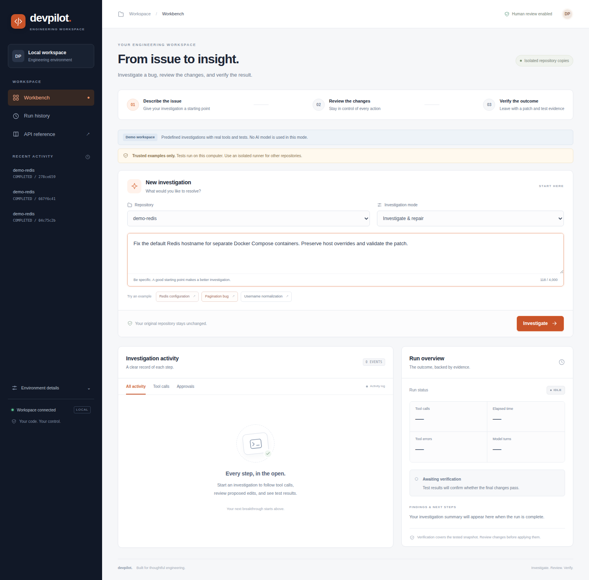

# Browser workbench

The interface was redesigned on 2026-09-21 with a dark navigation rail, a light workspace, restrained orange accents, and clearer task, activity, approval, and result panels.

This screenshot is from the actual local application in Chrome, connected to the scripted demo. It is not a live-model session or an invented successful run.

## Using the interface

Open http://127.0.0.1:8091 when starting with `./run.sh`. Direct CLI startup with the bootstrap configuration and Compose normally use port 8088.

Connect using the local token, choose a repository and investigation mode, and describe the issue. Example buttons populate both the task and repository. Ctrl+Enter or Command+Enter starts an investigation when connected. The character counter reflects the 4,000-character limit.

Activity filters show all recorded activity, tool results, or approval events. Edit and test actions present the actual pending approval. The run overview shows measured metrics and independently recorded verification. Completed runs expose patch, report, and trace downloads. Recent runs can be reopened from the sidebar; environment details expand separately.

The scripted-demo and trusted-host-execution notices remain visible when those modes are active. These labels are part of presenting the application's capabilities accurately to a client.

The responsive layout supports desktop, tablet, and phone screens. Keyboard focus, a skip link, labelled inputs, filter selection states, and reduced-motion preferences are supported. Icons and styles are served locally; no external fonts or UI framework are required.

The HTML document, static assets, and API responses send `Cache-Control: no-store`. Normal navigation or reload fetches the current UI after deployment; a hard refresh is not required. Already-open tabs do not automatically reload during an investigation.

## Browser validation

Chrome 150.0.7871.181 completed the actual Redis demo workflow after the redesign:

- Connection, repository selection, example selection, and character counter passed.
- Baseline tests, exact code edit, and post-edit tests were approved through the UI.
- Final verification appeared and the downloaded patch contained the expected change.
- Activity filters worked, with no JavaScript page errors.
- Layouts at 1500, 1024, 768, 390, and 360 pixels had no horizontal document overflow.

Evidence is in [browser-results.json](../outputs/local-ui-redesign/browser-results.json). The local reproduction script is [browser_check.py](../outputs/local-ui-redesign/browser_check.py); it expects the demo server on port 8091 and the installed Chrome binary. It starts a real bundled demo run, so it is not a read-only screenshot script.

[Mobile screenshot](ui-mobile-redesign.png) · [Approval screenshot](../outputs/local-ui-redesign/desktop-approval.png) · [Completed run screenshot](../outputs/local-ui-redesign/desktop-completed.png)

The existing `scripts/capture_ui.py` remains available for isolated fixture captures using the optional Playwright dependency and a browser binary. No Node build is needed to run the frontend.

## Historical evidence

The earlier packaged UI preview and the failed browser attempt described in `outputs-previous-0.2.0/ui-smoke.json` belong to the older interface and packaging environment. They do not describe this redesign's successful local browser test. Live-model and Docker-runner limitations remain documented separately in [REAL_EXAMPLE_CHECK.md](REAL_EXAMPLE_CHECK.md).
